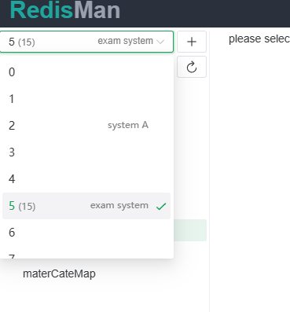
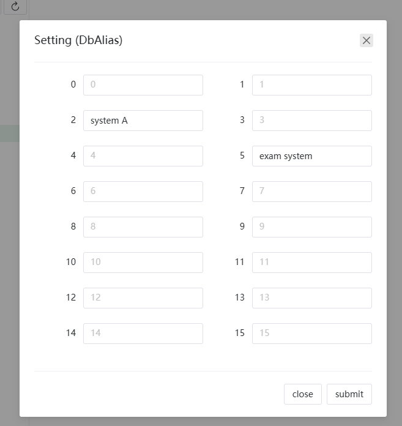
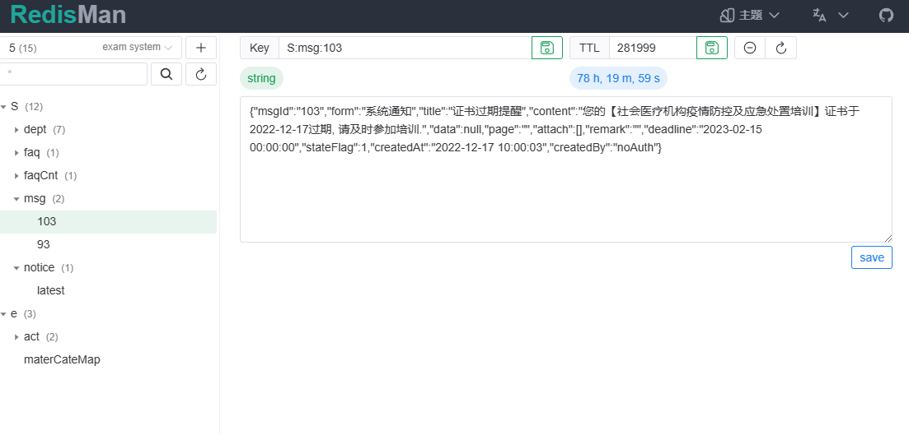
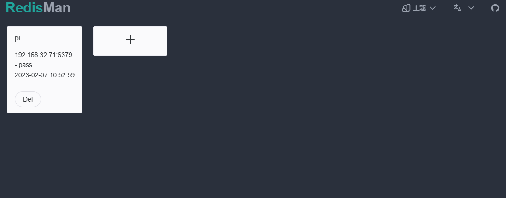

# RedisMan [WIP]

## feature
- webui / desktop
- 支持 stream(redis6.0), username(6.0), bitmap, json [WIP]
- 团队使用,多用户,多角色, 共享redis连接 [WIP]
- 更友好的显示 [WIP]
- 更多场景支持 [WIP]
- db 别名
- 连接分组 [WIP]

## roadmap

- [x] 树状显示key
- [x] 批量删除key
- [x] 给db添加别名
- [x] redis 用户名
- [ ] bitmap
- [ ] redis json 
- [x] 多连接
- [ ] 多用户,多角色, 限制用户只读模式
- [ ] ssh,ssl 连接
- [ ] 只读模式操作
- [ ] 运行lua脚本
- [ ] 宏操作?
- [ ] 哨兵, 集群连接
- [ ] 状态监控
- [ ] 命令行模式
- [ ] 内存分析
- [ ] 标签分组
- [ ] 主题, i18n, 
- [x] sqlite, mysql
- [ ] jumpserver 转发 支持
- [x] human 显示剩余时长
- [ ] redis json支持
- [ ] 支持http? socket代理 (不同连接可使用不同代理)
- [ ] 数据库迁移? db2->db1
- [ ] hash,set,list复制成json
- [ ] 精准搜索(搜索记录)
- [ ] 超长key, 超长field显示
- [ ] 审计记录

## 截图

